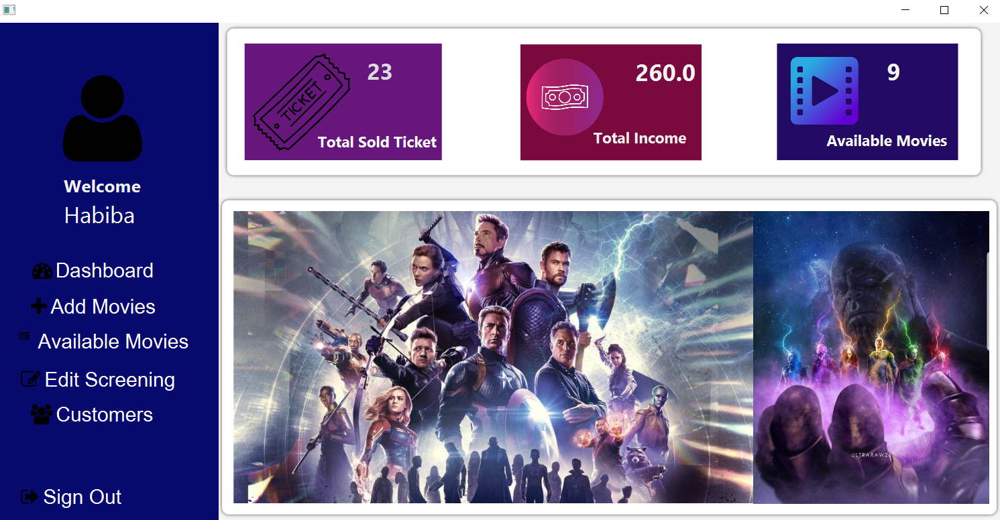
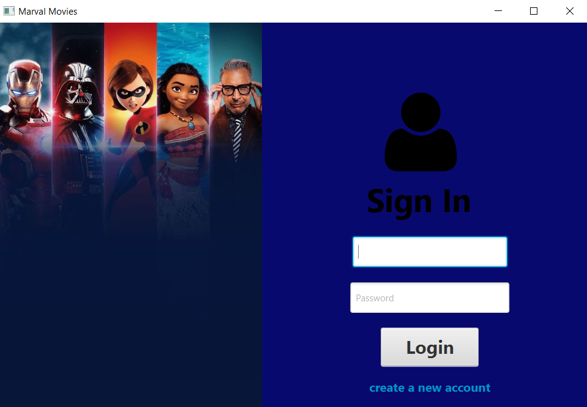
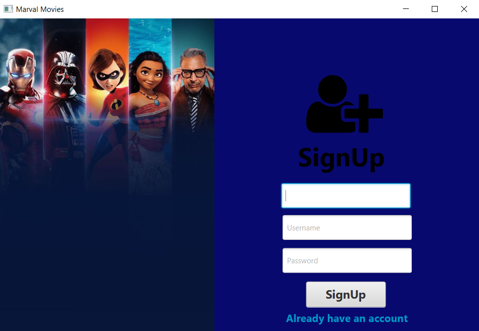
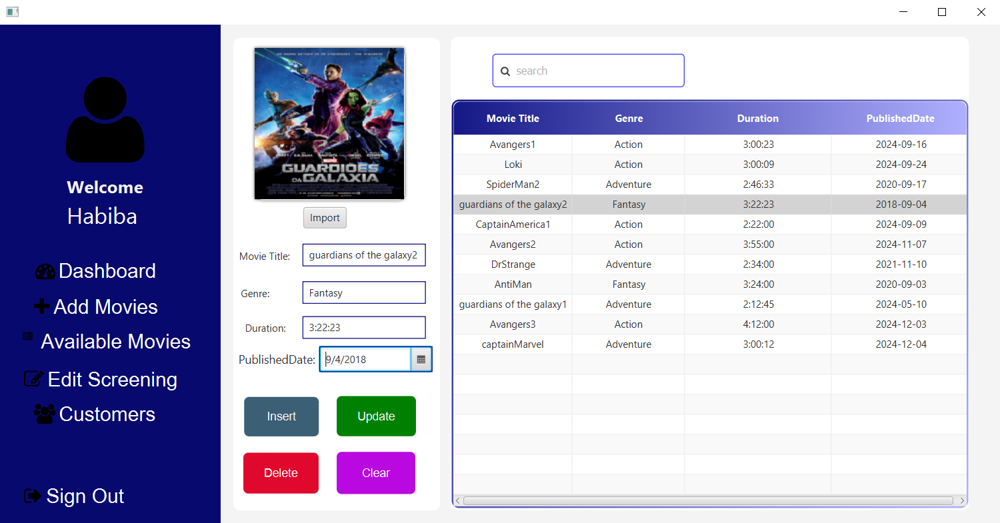
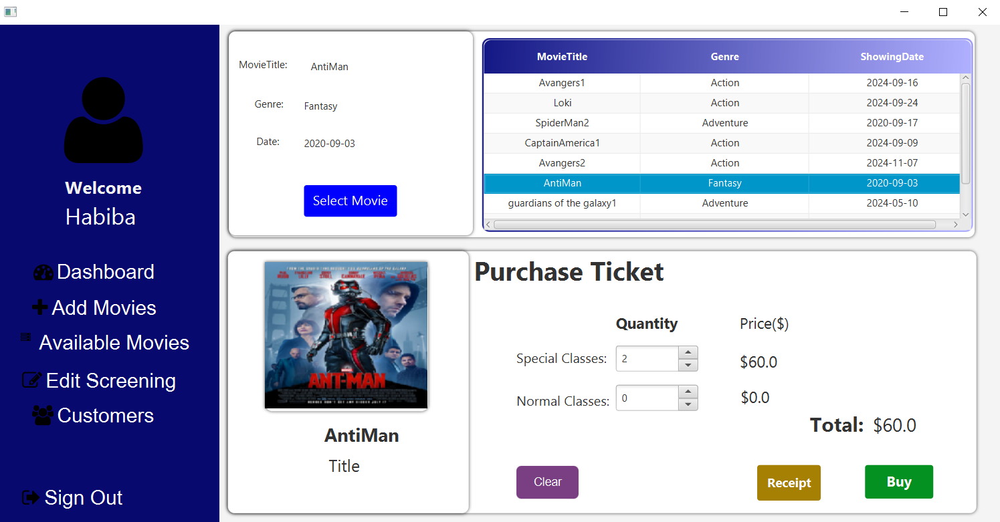
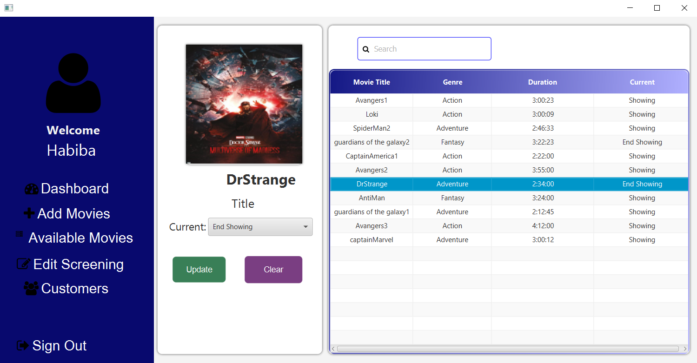
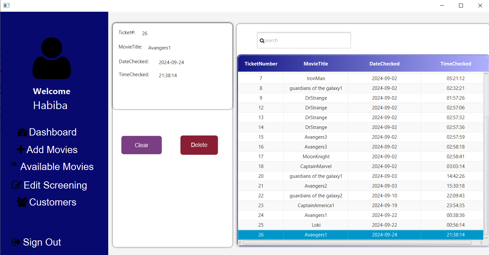

# `Movie Management System` 

## Introduction:

Movie management System is a desktop application where users can book movie's ticket,review about the system service. 
Admins can manage avaliable movies, book ticket for new customers. And the admin of this application can create, update and delete customers for their application and can also see the total earnings from their system .
In this way, the Movie management will be easier to handle with this application than they used to keep track of all details manually in their ledger. 
The customers and the employees can be more happy with this new system.

## Screenshots:

## `Dashboard Window`

Main Window  

## `Customer`

Customer Login  
  
Customer Sign-Up 
  

Add Movies 
  
Avaliable Movies 
  
Admin Check avaliable movies 
  

Customer Info 
  

  

## Used Library Files:

JFoenix 8.0.10: <a href = "https://github.com/Rakib-Hasan-455/Hotel_Management_System-JavaFx/raw/master/lib/jfoenix-8.0.10.jar"> Download </a> 
MySql JDBC Connector 8.0.26:  <a href = "https://github.com/Rakib-Hasan-455/Hotel_Management_System-JavaFx/raw/master/lib/mysql-connector-java-8.0.26.jar"> Download </a> 
FontAwesomeFX 8.9:  <a href = "https://github.com/Rakib-Hasan-455/Hotel_Management_System-JavaFx/raw/master/lib/fontawesomefx-8.9.jar"> Download </a> 
itextpdf-5.3.4:  <a href = "https://github.com/Rakib-Hasan-455/Hotel_Management_System-JavaFx/raw/master/lib/itextpdf-5.3.4.jar"> Download </a> 

## Requirements to Run this project/Jar/Exe file:
<li>Install MySql and it should be running on <b>localhost:3306</b>  .</li>
<li><a href = "https://github.com/habibaraab/JavaFXApplication9/blob/main/movie.sql"> Download </a> 
 Movie Management System Database and Install it into your MySql Database.</li>
<li> Your Java Version Must be 8 or above.</li>

## Things and Tools I Used in this project:
<li> IntellIJ IDE </li>
<li> SceneBuilder 8.5 (for JFoenix 8.0.10 & java 8 compatible) </li>
<li> Java 8 </li>
<li> JavaFX </li>
<li> MySql </li>
<li> MySql JDBC Connector </li>
<li> JFoenix UI Components 8.0.10 </li>
<li> FontAwesome Font Components </li>

